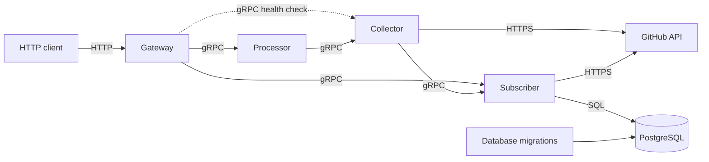

# Gomka122

A service for retrieving GitHub repository information and managing repository subscriptions. The public API uses HTTP, while internal services communicate over gRPC.

## Architecture



- **Gateway** — exposes the HTTP API and Swagger UI and translates HTTP requests into gRPC calls.
- **Processor** — currently forwards repository requests to the Collector without additional processing.
- **Collector** — retrieves repository data from the GitHub API.
- **Subscriber** — creates, deletes, and lists subscriptions.
- **PostgreSQL** — stores subscriptions; the schema is managed through migrations.

## Running the service

Docker and Docker Compose are required.

```bash
docker compose up --build
```

After startup:

- API: `http://localhost:8080`
- Swagger UI: `http://localhost:8080/docs/swagger/index.html`

Stop the services:

```bash
docker compose down
```

Remove the PostgreSQL data volume:

```bash
docker compose down -v
```

## HTTP API

| Method | Path | Description |
|---|---|---|
| `GET` | `/api/repositories/info?url=https://github.com/{owner}/{repo}` | Get repository information |
| `POST` | `/api/subscriptions` | Create a subscription |
| `DELETE` | `/api/subscriptions/{owner}/{repo}` | Delete a subscription |
| `GET` | `/api/subscriptions` | List subscriptions |
| `GET` | `/api/subscriptions/info` | Get information about all subscribed repositories |
| `GET` | `/api/ping` | Check service health |

Create a subscription:

```bash
curl -X POST http://localhost:8080/api/subscriptions \
  -H 'Content-Type: application/json' \
  -d '{"owner":"octocat","repo":"Hello-World"}'
```

Regenerate sqlc code:

```bash
cd subscriber/internal/adapter/postgres
sqlc generate
```

Regenerate Swagger documentation:

```bash
swag init \
  -g main.go \
  -d gateway/cmd,gateway/internal/controller/http,gateway/internal/domain \
  -o docs
```
