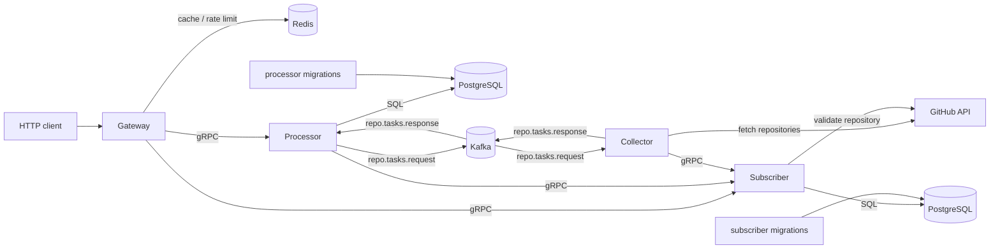

# Gomka122

Gomka122 is a compact Go service for reading GitHub repository metadata and managing repository subscriptions. Gateway is the public HTTP edge; internal services communicate through gRPC and Kafka, with PostgreSQL for state and Redis for gateway cache and rate limiting.

## Architecture



- **Gateway** exposes the HTTP API and Swagger UI, logs requests, rate-limits clients by IP, and caches successful read responses in Redis.
- **Processor** serves repository data from PostgreSQL. On a cache miss, it queues a Kafka fetch task and returns control to the caller.
- **Collector** consumes fetch tasks, reads the GitHub API, publishes task responses, and refreshes subscribed repositories every 15 seconds.
- **Subscriber** validates repositories through GitHub and stores subscriptions.
- **Kafka** uses `repo.tasks.request` and `repo.tasks.response` to decouple repository fetches from HTTP/gRPC request handling.
- **PostgreSQL** stores subscriptions and cached repository data. Migrations run automatically in Docker Compose.
- **Redis** stores gateway response cache and distributed rate-limit buckets.

## Requirements

- Docker
- Docker Compose
- GitHub token for authenticated GitHub API requests

Create a local `.env` file:

```bash
cp .env.example .env
```

Then set:

```env
GITHUB_TOKEN=github_pat_...
```

The `.env` file is used by Docker Compose for variable substitution.

Gateway runtime settings are defined in `compose.yaml`:

| Variable | Default | Description |
|---|---:|---|
| `RATELIMIT_CAPACITY` | `10` | Token bucket capacity per client IP |
| `RATELIMIT_REQ_PER_SECOND` | `5.0` | Token refill rate per client IP |
| `CACHE_TTL_SECONDS` | `60` | TTL for successful cached read responses |

## Running

Start the whole stack:

```bash
docker compose up --build
```

After startup:

- API: `http://localhost:8080`
- Swagger UI: `http://localhost:8080/docs/swagger/index.html`
- Redis: internal service at `redis:6379`
- Kafka from host: `localhost:9094`
- Subscriber PostgreSQL from host: `localhost:5432`
- Processor PostgreSQL from host: `localhost:5433`

Stop services:

```bash
docker compose down
```

Stop services and remove database volumes:

```bash
docker compose down -v
```

## HTTP API

| Method | Path | Description |
|---|---|---|
| `GET` | `/api/repositories/info?url=https://github.com/{owner}/{repo}` | Get repository information |
| `POST` | `/api/subscriptions` | Create a subscription |
| `DELETE` | `/api/subscriptions/{owner}/{repo}` | Delete a subscription |
| `GET` | `/api/subscriptions` | List subscriptions |
| `GET` | `/api/subscriptions/info` | Get information about subscribed repositories |
| `GET` | `/api/ping` | Check service health |

Repository information can return:

- `200 OK` when repository data is already available.
- `202 Accepted` when the repository fetch task has been queued and data is still being prepared.
- `400`, `404`, `429`, `502`, or `500` for invalid input, missing repositories, rate limiting, GitHub unavailability, or internal errors.

Successful `GET /api/repositories/info` and `GET /api/subscriptions/info` responses are cached by endpoint and client IP for `CACHE_TTL_SECONDS`.

Create a subscription:

```bash
curl -X POST http://localhost:8080/api/subscriptions \
  -H 'Content-Type: application/json' \
  -d '{"owner":"octocat","repo":"Hello-World"}'
```

Get repository information:

```bash
curl 'http://localhost:8080/api/repositories/info?url=https://github.com/octocat/Hello-World'
```

Check service health:

```bash
curl http://localhost:8080/api/ping
```

## Local Service Ports

| Service | Container port | Host port |
|---|---:|---:|
| Gateway HTTP | `8080` | `8080` |
| Processor gRPC | `50051` | `50051` |
| Collector gRPC | `50052` | `50052` |
| Subscriber gRPC | `50053` | `50053` |
| Redis | `6379` | `-` |
| Kafka external listener | `9094` | `9094` |
| Subscriber PostgreSQL | `5432` | `5432` |
| Processor PostgreSQL | `5432` | `5433` |

## Development

The module targets Go `1.25.0`.

Run Go tests:

```bash
go test ./...
```

Regenerate subscriber sqlc code:

```bash
cd subscriber/internal/adapter/postgres
sqlc generate
```

Regenerate processor sqlc code:

```bash
cd processor/internal/adapter/postgres
sqlc generate
```

Regenerate Swagger documentation:

```bash
swag init \
  -g main.go \
  -d gateway/cmd,gateway/internal/controller/http,gateway/internal/domain \
  -o docs
```
